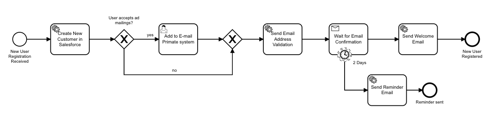
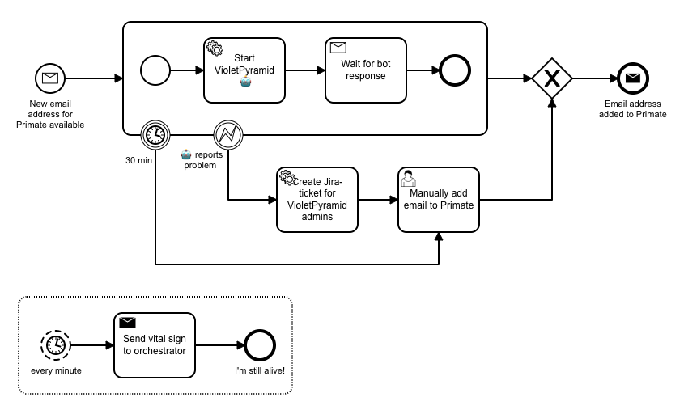

# Camunda Demo: Orchestrating your User Registration Process and improving it with RPA

Shows a New User Registration process orchestrated in Camunda Run.
Shows how to bridge to an RPA solution using embedded Camunda Engine in a spring-boot application that acts as one micro-service in the New User Registration orchestration.

## Step-by-Step Instructions

### Before you start the demo

- start fresh Camunda Run via docker:

  `docker run -d --name camunda -p 8080:8080 registry.camunda.cloud/cambpm-ee/camunda-bpm-platform-ee:run-7.13.0-SNAPSHOT`
- install license in admin
- stop (no delete) container: `docker stop camunda`
- prepare 3 terminal windows

### Show the demo

- start with user registration process downloaded from [Cawemo](https://cawemo.com):
  

  Open [1-new-user-registration-cawemo.bpmn](1-new-user-registration-cawemo.bpmn) in Camunda Modeler and add automation information:

  - set process name: New User Registration
  - add start form
    - form field:
      - id=`email`
      - type=`string`
      - label=`Email address`
      - validation=`required`
    - form field:
      - id=`newsletter`
      - type=`boolean`
      - label=`Wanna receive newsletter?`
  - add form for the single user task
    - form field
      - id=`primate_id`
      - type=`string`
      - label=`Primate ID`
      - validation=`required`
  - add automation stuff for Camunda Run using external task pattern
    - SF-task:
      - topic=`salesforceService`
    - Address Verification:
      - topic=`emailService`
      - Input mapping: id= `subject`, text=`Confirm your email address '${email}'`
    - Welcome:
      - topic=`emailService`
      - Input mapping: id=`subject`, Text=`Welcome!`
    - Reminder:
      - topic=`emailService`
      - Input mapping: id=`subject`, Text=`We're waitin'...`
  - gateway
    - no: default flow
    - yes: Expression=`${newsletter == true}`
  - add message definition
    - Message name: `confirm`
  - timer boundary:
    - duration
    - `PT30S`
  
  so the result should be like [2-new-user-registration-automated.bpmn](2-new-user-registration-automated.bpmn).
- start Camunda Run docker container: `docker start camunda`
- deploy process via deploy button in Camunda Modeler
- start process via [Camunda Tasklist](http://localhost:8080/app/tasklist/)
  - email: `yourname@yourcompany.com`
  - newsletter: `yes`
- Check [Camunda Cockpit](http://localhost:8080/app/cockpit/), see process instance waiting for external task
- implement external task workers for salesforce and mail tasks using the [template](js-worker/template.js)
  - [sf.js](js-worker/sf.js)
  - [mail.js](js-worker/mail.js)
- start task workers
  - `node js-workers/mail.js`
  - `node js-workers/sf.js`
- observe that salesforce worker immediately picks up some work
- check in cockpit that the process instance went ahead and now waits at e-mail confirmation receive task
- use swagger-editor for learning how to hand in message via REST
  - <https://editor.swagger.io>
  - load [openapi-7.13.0-alpha3.json](openapi-7.13.0-alpha3.json)
  - (change base from `engine-rest` to `rest`)
  - find message endpoint and execute via curl with following body:

  ```json
  {
    "messageName": "confirm",
    "correlationKeys": {
      "email": {
        "value": "yourname@yourcompany.com",
        "type": "String"
      }
    }
  }
  ```

- enjoy your first finished process instance by
  - showing history in Camunda Cockpit
  - inspecting log output of mail worker
- upgrade model to use RPA bot instead of user task, like in [3-new-user-registration-automated-rpa.bpmn](3-new-user-registration-automated-rpa.bpmn)
- deploy that process as new version to Camunda Run via Camunda Modeler
- explain the [rpa-worker](rpa-worker/)
  - show [process](rpa-worker/src/main/resources/process.bpmn)
    
  - explain how it is started: [ExternalTaskWorker.java](./rpa-worker/src/main/java/inc/acme/user/ExternalTaskWorker.java)
  - show that we mock a long-running RPA product: [VioletPyramid.java](./rpa-worker/src/main/java/inc/acme/user/mock/VioletPyramid.java)
- start the spring boot app in [rpa-worker](rpa-worker/)
- start a new instance via [Camunda Tasklist](http://localhost:8080/app/tasklist/)
  - email: `yourname@yourcompany.com`
  - newsletter: `yes`
- check in [Camunda Cockpit](http://localhost:8080/app/cockpit/) history view that it runs through the process up to the point where we wait for confirmation e-mail
